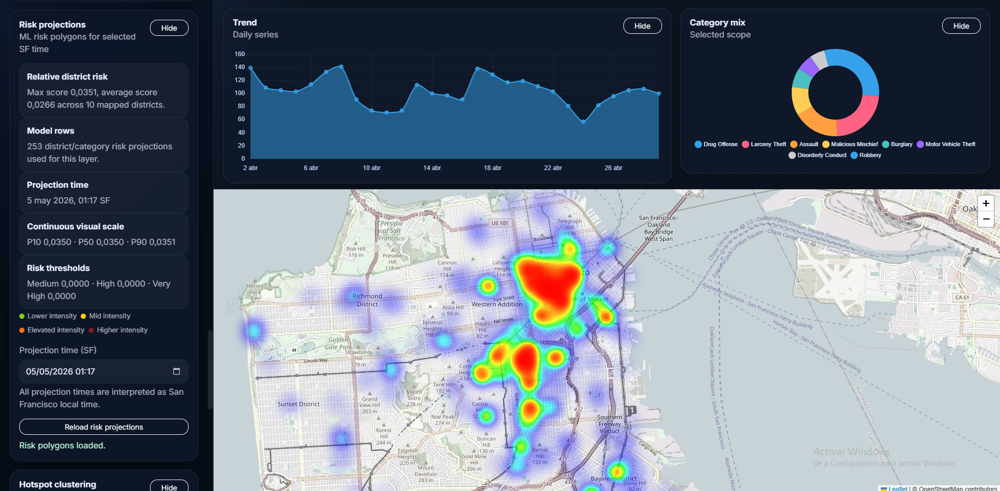

# 🛡️ CI SF — Crime Intelligence San Francisco

A data-driven platform for analyzing and predicting crime activity in San Francisco.

Transforming raw incident data into **spatial insights, risk signals, and predictive intelligence**.

---

## 🎨 Demo



---

## 🚀 Overview

CI SF combines:

- 📍 Geospatial analysis  
- 📊 Time-series data  
- 🤖 Machine learning  

to provide both:

- **district-level risk awareness**  
- **route-level risk evaluation**

---

## 🗺️ Key Features

- Interactive map with:
  - incident points  
  - hotspot clustering (DBSCAN)  
  - heatmaps and prediction layers  

- Analytics dashboard:
  - KPIs and trends  
  - category distribution  
  - district comparison  

- Risk modeling:
  - real-time signals  
  - predictive scoring  

---

## 🧠 Architecture

```text
RAW → AGGREGATES → FEATURES → PREDICTIONS → API → UI